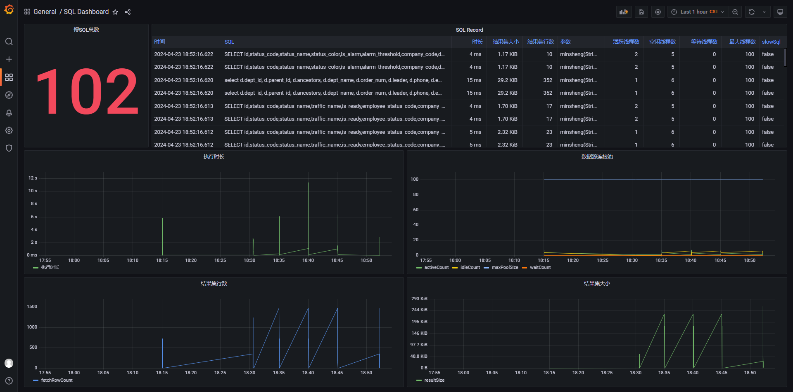

# 慢SQL监控组件

## Usage

### Spring boot
```java

@SpringBootApplication
// 开启慢SQL监控
@EnableSlowSqlMonitor
public class SpringbootApplication {

    public static void main(String[] args) {
        SpringApplication.run(SpringbootApplication.class, args);
    }

}

```
application.yml
```yaml
slow-sql-monitor:
  slow-millis: 1000 # 单位毫秒
```
pom.xml
```xml
<dependencys>
    <dependency>
        <groupId>io.github.zzusp</groupId>
        <artifactId>slow-sql-monitor-spring-boot-autoconfigure</artifactId>
        <version>1.0.1</version>
    </dependency>
    <!-- 如果项目中有使用的druid就引入 -->
    <dependency>
        <groupId>io.github.zzusp</groupId>
        <artifactId>slow-sql-monitor-pool-druid</artifactId>
        <version>1.0.1</version>
    </dependency>
    <!-- 如果项目中有使用的hikari就引入 -->
    <dependency>
        <groupId>io.github.zzusp</groupId>
        <artifactId>slow-sql-monitor-pool-hikari</artifactId>
        <version>1.0.1</version>
    </dependency>
</dependencys>
```
自定义拦截器（将拦截器注册为Bean对象，即可自动加载）
```java

import org.springframework.stereotype.Component;
import com.slowsql.plugin.Interceptor;
import com.slowsql.stat.SlowSqlStat;
import org.slf4j.Logger;
import org.slf4j.LoggerFactory;

@Component
public class CustomInterceptor implements Interceptor {

    private final static Logger logger = LoggerFactory.getLogger(CustomInterceptor.class);

    public CustomInterceptor() {
    }

    @Override
    public void beforeExecute(SlowSqlStat slowSqlStat) {
        // 在SQL执行之前，执行一些操作。为避免影响性能，请务必异步处理！！！
    }

    @Override
    public void afterExecute(SlowSqlStat slowSqlStat) {
        // 在SQL执行之后，执行一些操作。为避免影响性能，请务必异步处理！！！
    }

    @Override
    public void closeExecute(SlowSqlStat slowSqlStat) {
        // 在SQL执行结束，执行一些操作。为避免影响性能，请务必异步处理！！！

        if (slowSqlStat.isSlowSql()) {
            // 如果为慢SQL，执行一些操作。为避免影响性能，请务必异步处理！！！
        }
    }
}

```
### Spring
```java

@Configuration
public class AppConfig {

    @Bean
    public SlowSqlMonitorBeanProcessor slowSqlMonitor() {
        SlowSqlConfig config = new SlowSqlConfig();
        config.setSlowMillis(1000L);
        // 自定义拦截器
        CustomInterceptor interceptor = new CustomInterceptor();
        slowSqlConfig.getInterceptorChain().addInterceptor(interceptor);
        return new SlowSqlMonitorBeanProcessor(config);
    }

}

```
pom.xml
```xml
<dependencys>
    <dependency>
        <groupId>io.github.zzusp</groupId>
        <artifactId>slow-sql-monitor-spring</artifactId>
        <version>1.0.1</version>
    </dependency>
    <!-- 如果项目中有使用的druid就引入 -->
    <dependency>
        <groupId>io.github.zzusp</groupId>
        <artifactId>slow-sql-monitor-pool-druid</artifactId>
        <version>1.0.1</version>
    </dependency>
    <!-- 如果项目中有使用的hikari就引入 -->
    <dependency>
        <groupId>io.github.zzusp</groupId>
        <artifactId>slow-sql-monitor-pool-hikari</artifactId>
        <version>1.0.1</version>
    </dependency>
</dependencys>
```
### Without Spring
```java

public class SqlMonitor {

    public DataSource dataSource() throws Exception {
        Properties properties = new Properties();
        properties.setProperty("driverClassName", "com.mysql.jdbc.Driver");
        properties.setProperty("url", "");
        properties.setProperty("username", "");
        properties.setProperty("password", "");
        DataSource dataSource = DruidDataSourceFactory.createDataSource(properties);
        
        // 监控配置
        SlowSqlConfig slowSqlConfig = new SlowSqlConfig();
        slowSqlConfig.setSlowMillis(1000L);
        // 自定义拦截器
        CustomInterceptor interceptor = new CustomInterceptor();
        slowSqlConfig.getInterceptorChain().addInterceptor(interceptor);
        return new SlowSqlDataSource((DataSource) bean, slowSqlConfig);
    }
    
    // use the dataSource

}

```
pom.xml
```xml
<dependencys>
    <dependency>
        <groupId>io.github.zzusp</groupId>
        <artifactId>slow-sql-monitor</artifactId>
        <version>1.0.1</version>
    </dependency>
    <!-- 如果项目中有使用的druid就引入 -->
    <dependency>
        <groupId>io.github.zzusp</groupId>
        <artifactId>slow-sql-monitor-pool-druid</artifactId>
        <version>1.0.1</version>
    </dependency>
    <!-- 如果项目中有使用的hikari就引入 -->
    <dependency>
        <groupId>io.github.zzusp</groupId>
        <artifactId>slow-sql-monitor-pool-hikari</artifactId>
        <version>1.0.1</version>
    </dependency>
</dependencys>
```